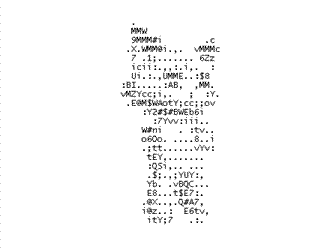

### Hi, I'm Darlin Ruben.

Junior Full Stack Developer. 
with experience in personal projects such as <a href="https://github.com/Ruben890/-python-django-crud-django-myql">CRUD</a>,   <a href="https://github.com/Ruben890/To-Do-list">TO DO LIST</a>, <a href="https://github.com/Ruben890/blog-python-Django">BLOG</a>,  and web application to <a href="https://github.com/Ruben890/Salary-Discount-Calculate">calculate salaries</a>. 

<!--

  <a href="https://github.com/Ruben890">
  
  

-->

 
### 🏆Github Stats :

 

 
 
 
  

  
### 💻Languages ​​and little sisters🧑‍💻:

